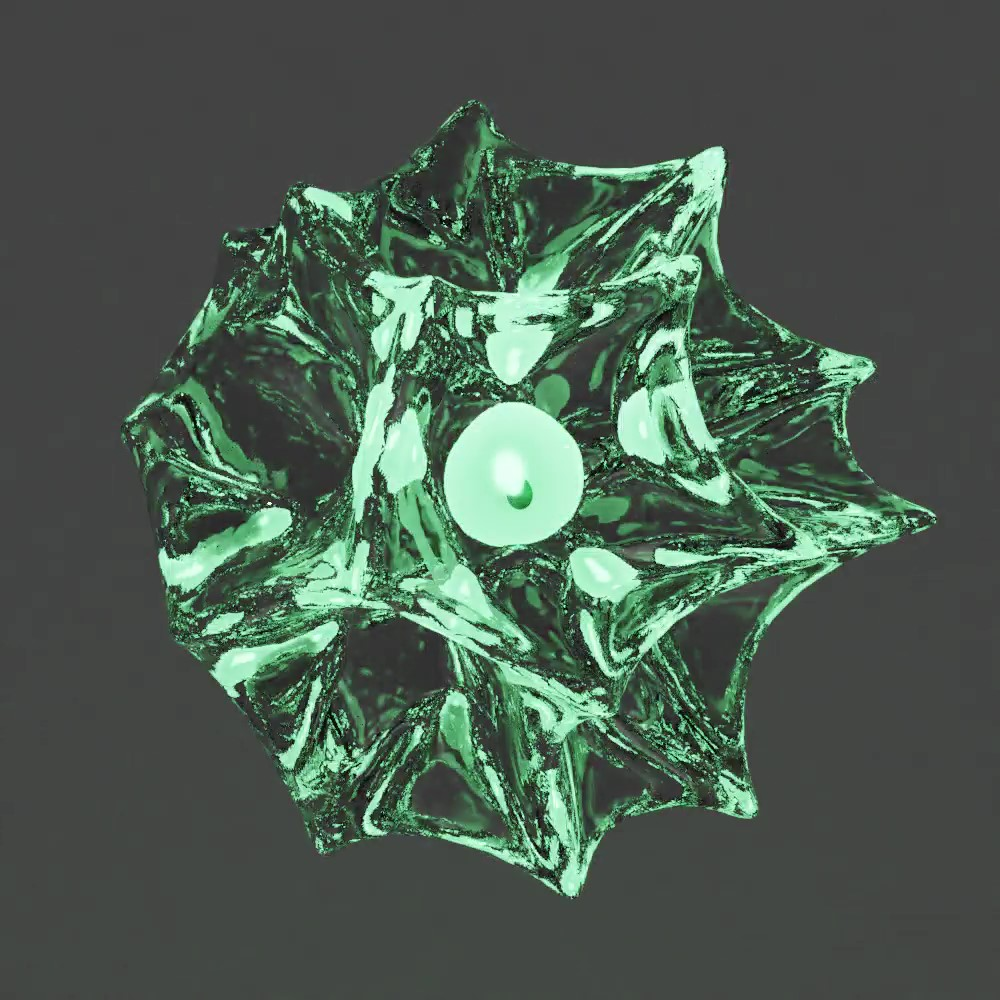

# 3D Models 

Here are some of the 3D models and animations that I have made using Blender, for various personal projects and for fun. 

# Fender Stratocaster

A model I made for my Dad as he loves the Fender,

| | |
|---|---|
|||
|||

# Artura Canopy

This is a small mock up model I made for Artura Ltd. with a rain simulation that uses dynamic texture painting and fluid simulation for the canopy streams and droplets.

[Video file](ArturaCanopy/canopy_rain_texture_fluidsim.mkv)

Screenshot

# Thunderbirds 3 and 5

Thunderbird 3 was my first model without a tutorial. Thunderbird 5 was made after I had quite a few more models under my belt!

| | |
|---|---|
|||

# Lula

This is a model I made of Lula, and a pretty awful hair simulation..

The head hair was having a lot of problems..probably due to poor head topology!

# Textured House Model

This is a model I made of a house, in order to practice texturing.

| | |
|---|---|
|||

# Other models

Here are some other early models testing cloth simulations and transparent cycles rendering. Videos are in the [Other](./Other) folder

Spiky guy

Cloth icosahedron test [Video](Other/cloth_icosahedron.mkv)

Screenshot

