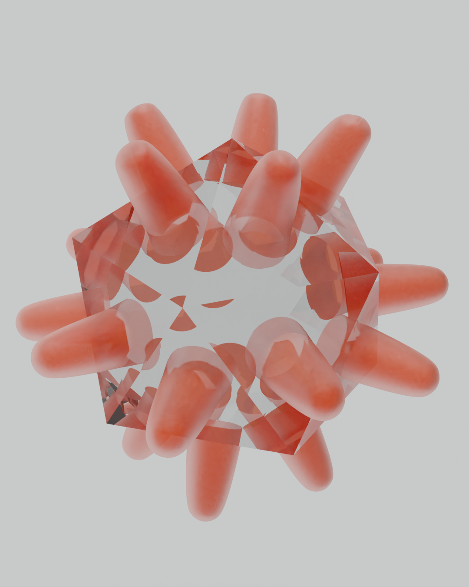

# Rory Whybrow Portfolio
This repository contains my digital portfolio, showcasing various aspects of my software development and documentation skills. For easily viewing images (GitHub website is not great at this), consider cloning this repository!

# Sample Documentation

The [Documentation](./Documentation) folder contains sample readme documentation that I wrote whilst at Uni-Soft systems (containing generic information, not pertaining to specific products developed by the company).
- The [PythonStyleGuide](./Documentation/PythonStyleGuide.md) contains the writing style guide for python that I produced for Uni-Soft, in line with PEP-8 and the company preferences. 
- The [DjangoTesting](./Documentation/DjangoTesting.md) readme contains information for how to configure and test Django application using pytest, with a brief guide on how to write tests. 
- The [WordpressMAMPReadme](./Documentation/WordpressMAMPReadme.md) contains a readme for installing and restoring a backup copy of a cached WordPress site with MAMP, and how to edit various aspects of the site templates in PHP. 

# Machine Learning

Due to confidentiality agreements, I am unable to showcase my work on the SegNet algorithm (a convolutional auto-encoder used for image segmentation) that was conducted at Uni-Soft. However, I can share the example code that I wrote and found useful when first starting machine learning and following the course 'Machine Learning for Physicsits' from the Max Planck Institute. These examples can be found in the [ML-Physicists-Examples](https://github.com/rorg314/ML-Physicists-Examples) repository.  

# Blockchain

The [Blockchain](./Blockchain) folder contains resources I produced whilst at Uni-Soft systems covering various aspects of blockchain technology (documents have been converted to markdown files for ease of viewing in GitHub). 

- A generic [presentation](./Blockchain/GeneralBlockchainPresentation.pptx) introducing the concepts and technology + a short review of NFTs

- A [document](./Blockchain/NFTs.md) covering NFTs and the ERC-721 protocol, with some ideas for potential applications.

- A [detailed review](./Blockchain/SolanaBlockchain.md) of the Proof of Stake/History architecture used by the Solana blockchain. 

# Game development

The [GameScreenshots](./GameScreenshots) folder contains screenshots from games that I am currently working on using Unity (C#). The majority of games are either unfinished (except solitaire) or only focus on implementation of technical tools such as voxel terrain generation. 

See the individual repositories of each game for more information + screenshots.  

- [Solitaire](https://github.com/rorg314/Solitaire)
- [Circuit Building Game](https://github.com/rorg314/CircuitBuilder)
- [Space Colony](https://github.com/rorg314/SpaceColony)
- [Desert Island Dogs](https://github.com/rorg314/DesertIslandDogs)

# Mathematical Physics on YouTube

Here is a link to my [youtube channel](https://www.youtube.com/channel/UC9bTwyZMt5HxScZ5f7BT34Q), where I make concise (15 min) mathematical physics lectures (and my dog watches!), covering topics usually ommited on standard physics courses (differential geometry, multilinear algebra, group theory).

I am currently uploading a series of videos covering Special and General relativity from a differential geometric perspective, building on topics previously covered on the channel. 

I regularly receive and answer questions, and really enjoy the discourse with people watching each video!

|[Relativity notes](./WHYBmaths/Relativity_Notes.pdf) | [Tensors, Topology, Manifolds notes](./WHYBmaths/TensorsTopologyManifolds.pdf) |
|-|-|
|||
# MSc Thesis - Einstein-Cartan Gravity

This repository also contains a copy of my [MSc thesis](./MScThesis/Edge_Modes_and_Boundary_Condition_in_Gauge_Theories.pdf), where I worked on solving an open problem in Einstein-Cartan relativity. The standard formalism for General Relativity implies that spacetimes with boundaries will have a degenerate boundary geometry. I derived and verified constraints for a modified Einstein-Cartan action in a half 2+1 de Sitter (+ Minkowski) spacetime that resolves this degeneracy (provided a suitable boundary cosmological constant term is introduced). 

# 3D Modelling

Some renders from my learning process with blender are in the [3DModels](./3DModels) folder.

| | | 
|--|--|
|| |
|| |
| | |